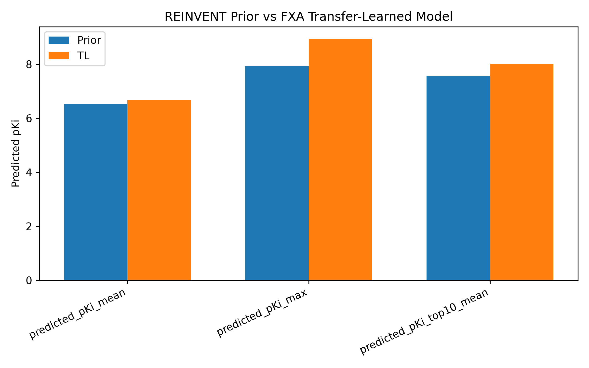
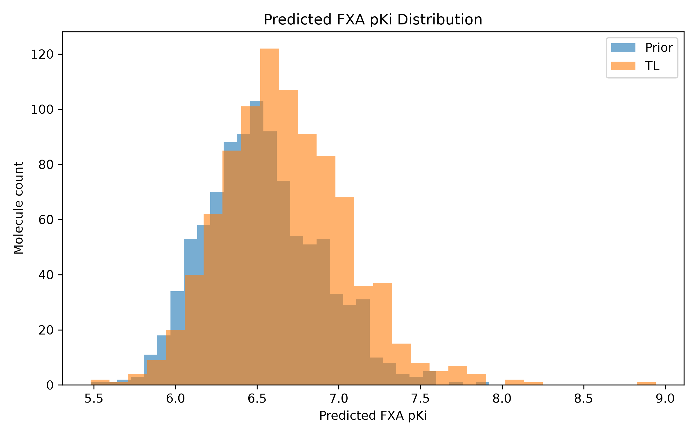
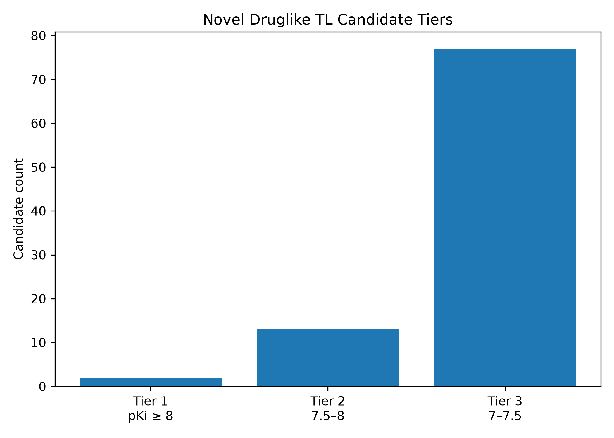

# REINVENT-Based Generative Design of Factor Xa Inhibitors Using Scaffold-Aware ML Scoring

## Project Summary

This project demonstrates an end-to-end generative molecular design workflow for **Factor Xa (FXa) inhibitor discovery** using **REINVENT4 transfer learning** and a previously developed **scaffold-aware machine learning activity model**.

The goal was to test whether a REINVENT prior model could be shifted toward generating molecules with higher predicted FXa activity after transfer learning on potent FXa-like molecules. The result was positive: even a short 5-epoch transfer-learning sanity run enriched the generated chemical space for molecules with higher predicted FXa pKi.

This project builds directly on **Project 1** — [Factor-Xa-QSAR-GNN-Activity-Prediction](https://github.com/elumalaipavadai/Factor-Xa-QSAR-GNN-Activity-Prediction) — which trained the scaffold-aware Factor Xa activity model used here as the scoring function.

> **Note:** The Project 1 scoring model (`fxa_05b_best_scaffold_feature_model.joblib`) and the REINVENT4 prior are **external inputs** and are not redistributed in this repository. The trained model is available from the [Project 1 Releases](https://github.com/elumalaipavadai/Factor-Xa-QSAR-GNN-Activity-Prediction/releases); the prior from the [REINVENT4 project](https://github.com/MolecularAI/REINVENT4).

---

## Main Result, Corrected for Unequal Sample Sizes

The original prior and transfer-learned (TL) model produced different numbers of valid unique molecules after sampling: **982** for the prior and **911** for the TL model. Therefore, the most defensible comparison uses both raw counts and rates normalized by the number of valid molecules.

| Metric | Original REINVENT Prior | FXA Transfer-Learned Model | Interpretation |
|---|---:|---:|---|
| Valid generated molecules | 982 | 911 | TL produced fewer valid unique molecules after sampling. |
| Mean predicted pKi | 6.531 | 6.674 | +0.143 pKi shift. |
| Median predicted pKi | 6.509 | 6.647 | +0.138 pKi shift. |
| Max predicted pKi | 7.922 | 8.942 | +1.020 pKi increase. |
| Top-10 mean predicted pKi | 7.573 | 8.021 | +0.448 pKi enrichment among top-ranked molecules. |
| Predicted pKi >= 7 | 102 / 982 (10.4%) | 171 / 911 (18.8%) | +69 molecules; +8.4 percentage points. |
| Predicted pKi >= 8 | 0 / 982 (0.0%) | 4 / 911 (0.4%) | TL produced high-scoring molecules absent from the prior sample. |
| Novel vs FXA reference | 982 / 982 (100.0%) | 911 / 911 (100.0%) | Both sets were fully novel by flat canonical SMILES comparison. |
| Basic druglike molecules | 791 / 982 (80.5%) | 600 / 911 (65.9%) | Druglike fraction decreased by 14.7 percentage points. |

**Key interpretation:** Transfer learning increased the fraction of generated molecules with predicted pKi >= 7 from **10.4%** to **18.8%**, while generating **4** molecules with predicted pKi >= 8 compared with **0** from the original prior. This is a rate-normalized enrichment, not just a raw-count artifact.

The main trade-off was drug-likeness: the basic druglike fraction decreased from **80.5%** to **65.9%**, which justifies the downstream candidate-prioritization step.

---

## Figures

### Prior vs TL key metrics


### Prior vs TL predicted pKi distribution


### TL candidate tier counts


---

## Candidate Prioritization Result

After scoring the TL-generated molecules, candidates were filtered for:

1. Valid RDKit molecule
2. Novel relative to the Project 1 FXA reference set
3. Basic druglike properties
4. High predicted FXA pKi

This produced **600 valid, novel, druglike TL-generated candidates**. Among these 600 candidates, **92 had predicted pKi >= 7** and were assigned to three priority tiers:

| Candidate Tier | Criteria | Count |
|---|---|---:|
| Tier 1 | Novel + druglike + predicted pKi >= 8.0 | 2 |
| Tier 2 | Novel + druglike + predicted pKi 7.5-8.0 | 13 |
| Tier 3 | Novel + druglike + predicted pKi 7.0-7.5 | 77 |
| Docking queue | Top prioritized candidates for structure-based follow-up | 30 |

The best prioritized candidate from the docking queue was:

| Property | Value |
|---|---:|
| SMILES | `O=c1ccccn1-c1ccc(NS(=O)(=O)c2ccc(Cl)s2)cc1` |
| Predicted FXA pKi | 8.116 |
| RF tree uncertainty | 1.290 |
| MW | 366.85 |
| cLogP | 3.35 |
| QED | 0.769 |
| Novel vs FXA reference | Yes |
| Basic druglike flag | Yes |

---

## Project Context

This project builds directly on Project 1, where a scaffold-aware Factor Xa activity model was trained using curated ChEMBL FXa bioactivity data.

The scoring model used here is a scikit-learn pipeline:

```text
SimpleImputer -> VarianceThreshold -> RandomForestRegressor
```

trained on Morgan fingerprints:

```text
Morgan radius = 2
Fingerprint size = 2048 bits
Binary Morgan fingerprint
```

In this project, that model was used as a scoring function to evaluate molecules generated by REINVENT.

---

## Workflow Overview

```text
Project 1 FXA ML model
        |
        v
Prepare potent FXA seed molecules
        |
        v
Flatten and clean SMILES for REINVENT transfer learning
        |
        v
Filter unsupported elements for REINVENT prior compatibility
        |
        v
Split into train/validation SMILES
        |
        v
Run REINVENT transfer learning
        |
        v
Sample molecules from original prior and TL model
        |
        v
Score generated molecules with FXA RF model
        |
        v
Compare prior vs TL score distributions with rate-normalized metrics
        |
        v
Prioritize novel, druglike, high-scoring candidates
        |
        v
Create docking queue for structure-based validation
```

---

## Data Preparation

Potent FXa molecules were selected from the curated Project 1 dataset using pKi >= 8.0. The initial potent seed set contained **1249** molecules. After removing stereochemical notation and deduplicating flat canonical SMILES, **1211** unique flat potent FXa SMILES remained.

The first TL launch identified molecules containing unsupported elements for the REINVENT prior. A robust RDKit atom-symbol filter was applied using the supported elements C, N, O, S, F, Cl, and Br.

| Metric | Count |
|---|---:|
| Input flat SMILES | 1211 |
| Supported SMILES retained | 1199 |
| Removed SMILES | 12 |
| Drop fraction | 0.99% |

Unsupported elements removed were B (9 molecules), I (2 molecules), and P (1 molecule).

---

## Transfer Learning Setup

REINVENT4 was used in transfer-learning mode.

```toml
run_type = "transfer_learning"
device = "cpu"

num_epochs = 5
save_every_n_epochs = 1
batch_size = 50
sample_batch_size = 1000

input_model_file = "external/REINVENT4/priors/reinvent.prior"
output_model_file = "models/fxa_reinvent_tl_pki8_all_flat_sanity.model"

smiles_file = "data/reference/tl_split/fxa_tl_train_pki8_all_flat_elements.smi"
validation_smiles_file = "data/reference/tl_split/fxa_tl_valid_pki8_all_flat_elements.smi"

standardize_smiles = false
randomize_smiles = true
randomize_all_smiles = false
```

The final split contained approximately **959 training SMILES** and **240 validation SMILES**. The short transfer-learning run completed successfully, with the best validation loss observed at epoch 5. Because this was a short CPU sanity run, the result should be interpreted as a proof of concept rather than a fully optimized production model.

---

## Sampling and Scoring

Two 1000-molecule sampling runs were performed for fair comparison:

1. Original REINVENT prior
2. FXA transfer-learned REINVENT model

Generated molecules were scored using the Project 1 Factor Xa RandomForest model. Morgan fingerprints were generated with RDKit `MorganGenerator` using the same settings as Project 1: radius 2, 2048 bits, binary fingerprint, no chirality, and bond types enabled. RF uncertainty was estimated as standard deviation across tree predictions after applying the fitted preprocessing steps.

---

## Environment and Reproducibility

The scoring and analysis portion of this project (RF scoring, prior-vs-TL comparison, prioritization, and figures) can be reproduced with the pinned dependencies in `requirements.txt`:

```bash
pip install -r requirements.txt
```

The REINVENT4 generative step requires a separate installation. See `docs/REINVENT4_INSTALLATION_AND_SANITY_CHECK.md` for the full REINVENT4 setup, troubleshooting, and sanity-check record.

---

## Key Output Files

```text
results/tables/project2_final_key_metrics.csv
results/metrics/project2_final_summary.json
results/metrics/project2_final_summary.txt
results/figures/prior_vs_tl_key_metrics.png
results/figures/prior_vs_tl_predicted_pki_distribution.png
results/figures/tl_candidate_tier_counts.png
results/tables/tl_fxa_tier1_pki8_druglike_candidates.csv
results/tables/tl_fxa_tier2_pki7p5_druglike_candidates.csv
results/tables/tl_fxa_top100_ranked_candidates.csv
results/tables/tl_fxa_docking_queue_top30.csv
```

The most important practical output is:

```text
results/tables/tl_fxa_docking_queue_top30.csv
```

This file contains the top candidates for structure-based validation.

---

## Reproducible Script Order

```text
01_prepare_reinvent_seed_smiles.py
02_score_generated_smiles_with_fxa_model.py
03_prepare_tl_flat_seed_smiles.py
04a_make_tl_train_valid_split.py
04b_filter_tl_smiles_by_reinvent_supported_elements.py
05_score_tl_generated_smiles_with_fxa_model.py
06_score_prior_generated_smiles_with_fxa_model.py
06_compare_prior_vs_tl_scores.py
07_prioritize_tl_fxa_candidates.py
08_make_project2_summary_figures.py
```

---

## Strengths

This project is strong as a portfolio piece because it connects curated bioactivity modeling, scaffold-aware ML scoring, generative molecular design, transfer learning, novelty checking, drug-likeness filtering, uncertainty-aware prioritization, and a docking-ready output queue.

It shows a complete computational drug discovery workflow from activity model to generative design to candidate triage.

---

## Limitations

This project does not claim experimental activity.

Important limitations:

1. Predicted pKi values are model-based prioritization scores, not measured affinities.
2. The TL run was intentionally short and CPU-based, so it should be treated as a proof-of-concept sanity run.
3. The RandomForest model has uncertainty, especially for novel generated molecules.
4. Druglike fraction decreased after TL, showing why prioritization filters are necessary.
5. Docking and structure-based validation are still required.
6. ADMET and synthetic accessibility filters were not yet fully integrated.
7. No experimental validation was performed.

---

## Next Steps

The next logical project stage is structure-based validation.

Recommended follow-up:

1. Convert the top-30 docking queue to 3D conformers.
2. Prepare a Factor Xa receptor structure.
3. Dock candidates into the FXa active site.
4. Compare docking poses with known FXa inhibitor interactions.
5. Filter by docking score, binding mode, key interactions, ligand strain, ADMET properties, and model uncertainty.
6. Select a final top-5 candidate list.

---

## Final Portfolio Statement

This project demonstrates that a REINVENT prior can be transfer-learned toward Factor Xa inhibitor-like chemical space using potent FXa seeds, and that a scaffold-aware ML model can quantify the shift in generated molecule quality. Compared with the original prior, the TL model increased the rate of high-scoring predicted FXa molecules and produced a novel, druglike candidate queue for docking follow-up.

This provides a clear bridge from ligand-based machine learning to generative molecular design and structure-based validation.
